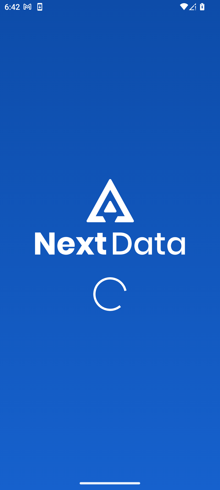
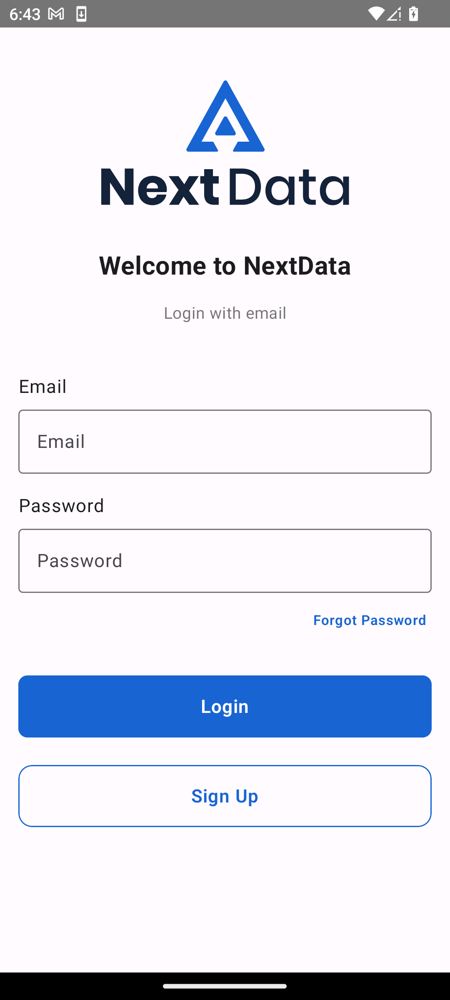
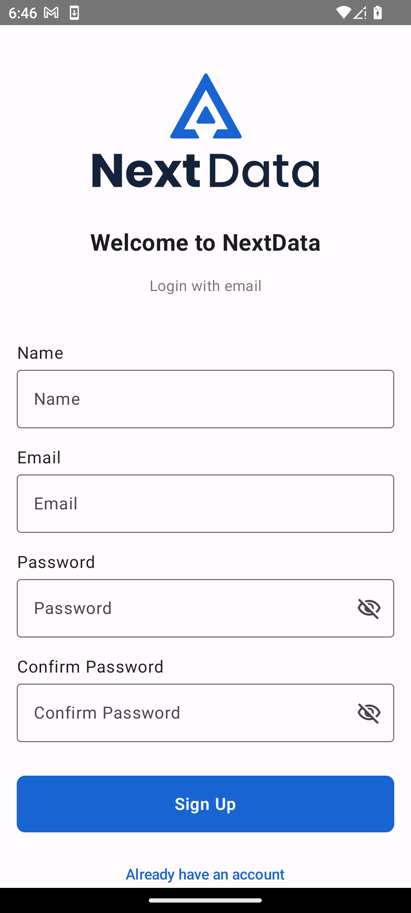
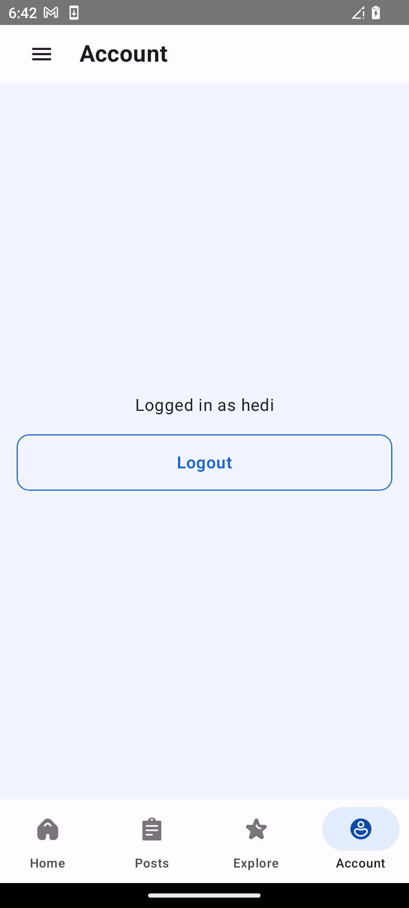
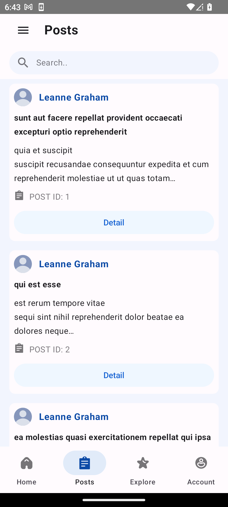
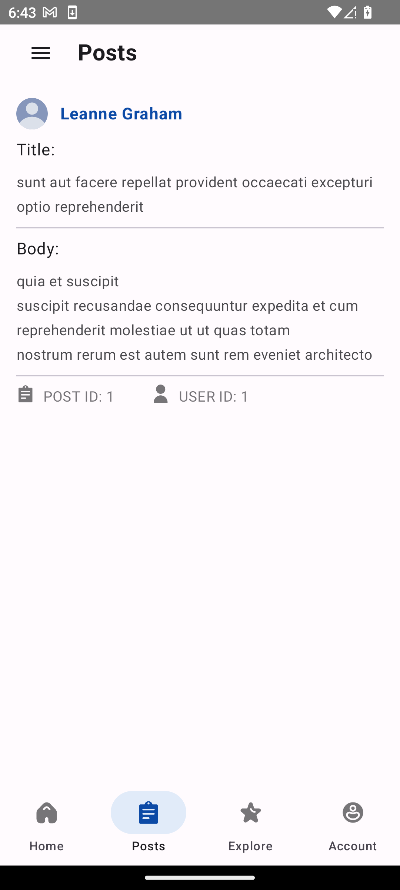
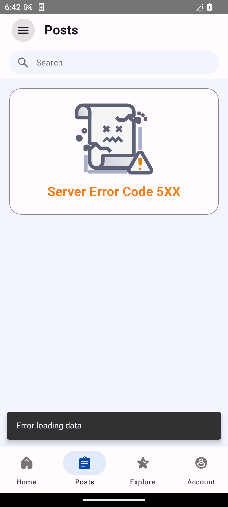
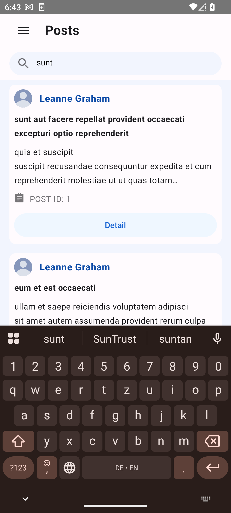

# Smart Conseil Technical Test — Native Android Developer

This repository contains the submission for the technical assessment for a Native Android Developer position at **Smart Conseil**.

<p>
  <br>
  
  
  
  
  
  
  
  
</p>

---

## 🚀 Features

### 📦 Dependencies Used

- **Retrofit** – For network API calls.
- **Hilt** – For dependency injection (apis, firebase instances, repositories..Etc).
- **Firebase Authentication** – Provides email/password sign-up and login.
- **Room** – Local database for caching posts and users data.

---

## 🛠️ Getting Started

### Option 1: Install the APK

- Navigate to the `/app/release/` folder.
- Download and install the prebuilt APK on your Android device (Release variant).

### Option 2: Build from Source

1. Clone the repository then open it in Android studio or simply just choose the option to open the project using VCS in Android Studio.
   ```bash
   git clone https://github.com/itshedimisawi/sc-test-android

2. Once opened, sync the project with Gradle to download all required dependencies, then build and run the app on your device or emulator. This will require a device running Android Pie (9) at least. 
